  

## Ciao, sono Danilo

Studente di Scienze e Tecnologie Informatiche all'Università Federico II di Napoli e sviluppatore full-stack junior. Lavoro su backend in Kotlin/Spring Boot e Node.js, app Android con Jetpack Compose e web app in React.

- **Studio:** laurea triennale in Scienze e Tecnologie Informatiche, prevista a dicembre 2026.
- **Cerco:** una prima esperienza come sviluppatore junior in un team dove crescere su progetti reali.
- **Fuori dall'università:** coltivo la passione per lo sviluppo di videogiochi e sperimento con Unity, Unreal Engine e Godot.

## Progetti in evidenza

### DietiEstates25 — Piattaforma immobiliare

Progetto universitario in team di 3 persone. Piattaforma per vendere, affittare e cercare casa, con tre tipi di utenza (amministratori, agenti e clienti): ricerca con filtri o su mappa, offerte e controproposte, notifiche push. Ho lavorato sul backend REST e sull'app Android.

Repository: [backend REST](https://github.com/Danilo-Scala/dietiestates25-backend)

### Meme Museum — Web app full-stack

Progetto universitario individuale per il corso di Tecnologie Web. Community per condividere meme: registrazione, upload di immagini con tag, voti, commenti e meme del giorno. Una Single Page Application in React comunica con un'API REST in Node.js protetta da JWT.

Repository: [server](https://github.com/Danilo-Scala/mememuseum-server) · [client](https://github.com/Danilo-Scala/mememuseum-client)

## Competenze

**Linguaggi**

**Backend**

API REST · Spring Security · JWT

**Frontend**

React Router · Axios

**Mobile**

Jetpack Compose · MVVM · Retrofit · OkHttp · Coroutines

**Database**

SQL · Spring Data JPA

**Strumenti e test**

SonarQube

**Game development**

## Contatti

Napoli · Altri progetti nei miei [repository](https://github.com/Danilo-Scala?tab=repositories).
